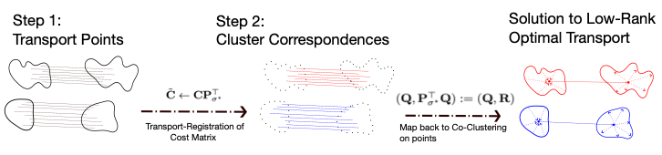

# Transport Clustering

**"Transport Clustering: Solving Low-Rank Optimal Transport via Clustering"**
[https://openreview.net/forum?id=gGnfUcXMe8](https://openreview.net/forum?id=gGnfUcXMe8)

<p align="center">
 
</p>

This repository contains the reference implementation and numerical experiments for the algorithms
and bounds proven in the paper, evaluated on synthetic benchmarks (planted Gaussians, planted
cliques, random weighted graphs, moons-and-Gaussians) and real data (CIFAR-10, mouse-embryo
single-cell time series). We show that **low-rank optimal transport (LR-OT)** &mdash; a non-convex,
NP-hard rank-constrained relaxation of the Kantorovich problem &mdash; reduces to a single instance
of **generalized $K$-means** once the cost matrix is *registered* through the optimal full-rank
transport plan, giving the first polynomial-time, constant-factor approximation algorithm for LR-OT.

## Background

Given probability vectors $a \in \Delta_n$, $b \in \Delta_m$ and a cost $c(\cdot,\cdot)$, the
Kantorovich problem finds the least-cost coupling over the transportation polytope
$\Pi(a,b) = \{P \in \mathbb{R}_+^{n\times m} : P\mathbf{1}_m = a,\ P^\top\mathbf{1}_n = b\}$:

$$
\min_{P \in \Pi(a,b)} \sum_{i=1}^n \sum_{j=1}^m P_{ij}\,c(x_i,y_j) \;=\; \min_{P \in \Pi(a,b)} \langle C, P \rangle_F.
$$

**Low-rank OT** (Forrow '19; Scetbon '21; Lin '21; Halmos '24) constrains the non-negative rank of
$P$ to at most $K \ll n$ by factoring the plan through two smaller couplings $Q, R$ sharing a latent
marginal $g \in \Delta_K$:

$$
\min_{\substack{Q \in \Pi(a,g),\, R \in \Pi(b,g) \\ g \in \Delta_K}} \big\langle C,\ Q\,\mathrm{diag}(g^{-1})\,R^\top \big\rangle_F.
$$

$K$-means is the special case $X = Y$, $C = C_{\ell_2^2}$: writing the (hard) assignment matrix as
$Q \in \{0, 1/n\}^{n\times K}$, its mean-free distortion is
$\langle C_{\ell_2^2},\ Q\,\mathrm{diag}(1/Q^\top\mathbf{1}_n)\,Q^\top \rangle_F$. **Generalized
$K$-means** (Scetbon '22) extends this mean-free objective to an arbitrary cost $C$ over hard
assignment matrices $\Pi_\bullet(u_n,\cdot)$:

$$
\min_{Q \in \Pi_\bullet(u_n,\cdot)} \big\langle C,\ Q\,\mathrm{diag}(1/Q^\top\mathbf{1}_n)\,Q^\top \big\rangle_F.
$$

## Transport Clustering

Since hard co-clustering assignments $Q, R \in \Pi_\bullet(u_n,g)$ share matching marginals, there
is always a permutation $P_\sigma$ with $R = P_\sigma^\top Q$. Substituting this reparametrization
into the low-rank OT objective and using the cyclic property of the trace collapses the
three-variable optimization $(Q,R,g)$ into an optimization over a single clustering matrix $Q$ and a
permutation $P_\sigma$:

$$
\min_{\substack{Q \in \Pi_\bullet(u_n,\cdot) \\ P_\sigma \in \mathcal{P}_n}} \Big\langle C P_\sigma^\top,\ Q\,\mathrm{diag}(1/Q^\top\mathbf{1}_n)\,Q^\top \Big\rangle_F.
$$

For any *fixed* $P_\sigma$, this is exactly the generalized $K$-means problem above. This raises the
natural question:

> *Is there an efficiently computable choice of permutation matrix $P_\sigma$ that accurately
> reduces low-rank optimal transport to the generalized $K$-means problem?*

We answer this in the affirmative: taking $P_\sigma = P_{\sigma^\ast}$, the solution to the
(convex, polynomial-time) full-rank transport problem, and using it to *register* the cost
$\tilde{C} = C P_{\sigma^\ast}^\top$, yields **Transport Clustering (TC)**:

> **Algorithm 1 (Transport Clustering).**
> **Input:** cost matrix $C \in \mathbb{R}^{n\times n}$, target rank $K$.
> 1. **Transport.** Compute the optimal full-rank plan
>    $P_{\sigma^\ast} \leftarrow n \cdot \arg\min_{P \in \Pi(u_n,u_n)} \langle C, P \rangle_F$.
> 2. **Clustering.** Register the cost $\tilde{C} \leftarrow C P_{\sigma^\ast}^\top$ and solve
>    generalized $K$-means:
>    $Q \leftarrow \arg\min_{Q \in \Pi_\bullet(u_n,\cdot)} \langle \tilde{C},\ Q\,\mathrm{diag}(1/Q^\top\mathbf{1}_n)\,Q^\top \rangle_F$.
>
> **Output:** the low-rank factors $(Q,\ P_{\sigma^\ast}^\top Q)$.

## Theoretical guarantees

Let $\gamma = \mathrm{OPT}(n)/\mathrm{OPT}(K) \in [0,1]$ be the ratio of the optimal full-rank to
rank-$K$ transport costs, and let $\rho \in [0,1]$ be an asymmetry coefficient on the cluster
variances. **Theorem 4.1** shows that, given an exact generalized $K$-means (or $K$-medians)
oracle, Algorithm 1 satisfies

$$
\min_{Q \in \Pi_\bullet(u_n,\cdot)} \big\langle \tilde{C},\ Q\,\mathrm{diag}(1/Q^\top\mathbf{1}_n)\,Q^\top \big\rangle_F
\;\le\;
\begin{cases}
(1+\gamma)\cdot \mathrm{OPT} & C \text{ a metric of negative type,} \\
(1+\gamma+\sqrt{2\gamma})\cdot \mathrm{OPT} & C \text{ a kernel cost,} \\
(1+\gamma+\rho)\cdot \mathrm{OPT} & C \text{ a general metric.}
\end{cases}
$$

**Theorem 4.3** extends the guarantee to black-box $(1+\epsilon)$-approximate $K$-means/$K$-medians
solvers (the bound above scales by $(1+\epsilon)^{-1}$), and **Proposition 4.2** exhibits hard
instances showing these bounds are tight. TC is, to our knowledge, the first polynomial-time,
constant-factor approximation algorithm for low-rank optimal transport, and empirically attains
lower transport cost than existing local solvers &mdash; FRLC (Halmos '24), LOT (Scetbon '21),
Factored-OT (Forrow '19), and LatentOT (Lin '21) &mdash; while its convergence to the Wasserstein
distance avoids the $\mathcal{O}(n^{-2/d})$ curse of dimensionality of full-rank OT.

## Repository layout

`src/` contains the core algorithms:

| File | Description |
| :--- | :--- |
| `monge_rotate.py` | Transport registration + generalized $K$-means in JAX: `monge_conjugate()` (Algorithm 1), mirror-descent solvers `gkms()`/`gkms_logdomain()`, and SDP (Burer-Monteiro) / $k$-means++ initializers. |
| `monge_rotate_lr.py` | Low-rank / factored variant that never materializes $C$: registers low-rank cost factors $(A,B)$ directly, with Sinkhorn or `HiRef` (hierarchical refinement) as the Step 1 transport solver for large $n$. |
| `clustering.py` | Lloyd's $k$-means / $k$-means++, used to initialize $Q$. |
| `distance_utils.py` | Cost-matrix and low-rank cost-factor utilities (e.g. squared-Euclidean factorizations). |
| `GKMS/` | Torch implementation of generalized $K$-means (mirror descent with a log-domain, semi-relaxed Sinkhorn inner solver). |
| `FRLC/` | Factor Relaxation with Latent Coupling baseline (Halmos '24). |
| `LatentOT/` | Latent-anchor OT baselines: `LOT` (Lin '21), `OT`, `FC` (Forrow '19). |
| `HiRef/` | Hierarchical-refinement OT solver, used both as a scalable registration step and as a baseline. |

`scripts/` runs and reproduces the paper's experiments:

| Path | Description |
| :--- | :--- |
| `run_methods.py` | CLI comparing TC (`-a mr`) against FRLC (`frlc`), low-rank Sinkhorn (`lot`), and LatentOT (`lin`) on a cost matrix or point clouds. |
| `run_methods.nf` | Nextflow pipeline sweeping algorithm $\times$ rank $\times$ seed over simulated instances. |
| `summarize_results.py` | Aggregates the per-run JSON summaries into result tables. |
| `experiments/` | Synthetic benchmark generators: planted Gaussians, planted cliques, random weighted graphs, concentric circles, moons-and-8-Gaussians, and a hand-built worst case for squared-Euclidean cost. |
| `experiments_large_scale/` | Large-scale evaluation harness (`run_LowRank.py`, `eval_LowRank.py`) and the mouse-embryo single-cell time-series case study (`single_cell.py`). |
| `plots/` | Figure-generation for transport plans and simulation sweeps. |

`notebooks/` reproduces individual results interactively (paths resolved via a `sys.path` insertion
to `../src`):

| Notebook | Description |
| :--- | :--- |
| `mr_test_2.ipynb` | Sanity-checks full-rank Monge registration and `GKMS` clustering against `FRLC` on the moons-and-Gaussians benchmark. |
| `mr_LR_test.ipynb` | Validates the low-rank, factored Transport Clustering solver (`monge_rotate_lr`) on planted-Gaussian instances at $n=2500$. |
| `CIFAR10_Evaluation.ipynb` | Co-clusters ResNet-18 CIFAR-10 embeddings and evaluates cluster purity against class labels. |
| `SingleCell_Evaluation*.ipynb` | Co-clusters consecutive mouse-embryo developmental timepoints (E8.5&ndash;E13.5) from single-cell transcriptomic data using the large-scale, `HiRef`-registered solver. |

`examples/` contains pre-generated cost matrices and optimal plans (planted Gaussians and random
weighted graphs at several sizes) for quickly sanity-checking a solver, `models/` holds the
pretrained ResNet-18 weights used for the CIFAR-10 embeddings, and `poster/` contains the ICML 2026
poster.

## Getting started

Solve low-rank OT with TC on a precomputed cost matrix:

```bash
cd scripts
python run_methods.py --cost_matrix ../examples/graph_n100_cost_matrix.txt -r 10 -a mr -o out
```

or directly in Python, from the transport-registered factors:

```python
import jax.numpy as jnp
from monge_rotate import monge_conjugate

Q, g, R = monge_conjugate(C, r=10)   # C: n x n cost matrix, r: target rank K
P = Q @ jnp.diag(1 / g) @ R.T         # recovered rank-K transport plan
```

`run_methods.py` writes the low-rank factors $(Q, g, R)$ and a JSON summary (objective cost,
marginal errors, runtime) for TC and for each baseline (`frlc`, `lot`, `lin`).

## Contact

For questions, discussions, or collaboration inquiries, feel free to reach out at [henri.schmidt@princeton.edu](mailto:henri.schmidt@princeton.edu) or [ph3641@princeton.edu](mailto:ph3641@princeton.edu).

## Citation

If you find this work useful, please cite:

```bibtex
@inproceedings{
schmidthalmos2026transport,
title={Transport Clustering: Solving Low-Rank Optimal Transport via Clustering},
author={Henri Schmidt and Peter Halmos and Benjamin Raphael},
booktitle={Forty-third International Conference on Machine Learning},
year={2026},
url={https://openreview.net/forum?id=gGnfUcXMe8}
}
```
